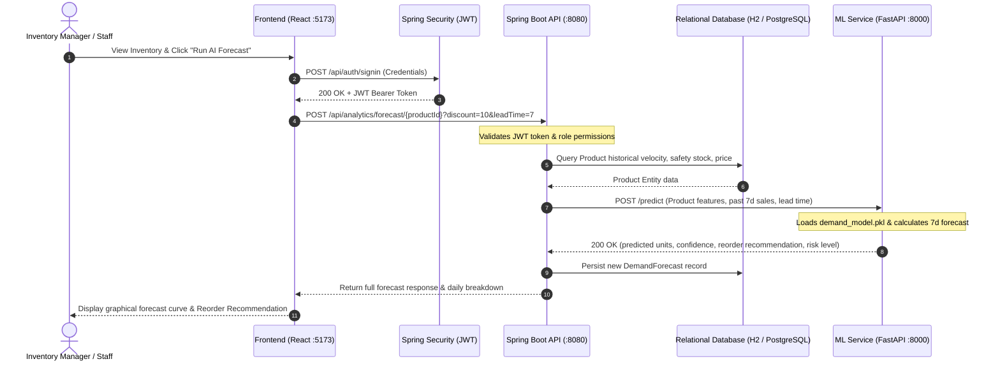

# BizSmart System Architecture

## 1. Overview
**BizSmart** is an intelligent, microservice-augmented ERP and inventory demand prediction system. It combines a high-performance Java Spring Boot backend, a Python machine learning demand forecasting microservice, and a responsive modern React frontend dashboard.

```
BizSmart/
│── frontend/              # Modern React + Vite + Tailwind CSS Dashboard
│── backend/               # Spring Boot 3 Java Application (REST, JPA, JWT Security)
│   ├── src/main/java/com/bizsmart/
│   │   ├── controllers/   # REST Endpoints (Auth, Products, Customers, Orders, Analytics)
│   │   ├── services/      # Business logic & ML RestClient integration
│   │   ├── models/        # JPA Entities (User, Role, Product, Category, Customer, Order, DemandForecast)
│   │   ├── repositories/  # Spring Data JPA interfaces
│   │   └── security/      # JWT Authentication & Role-Based Access Control (RBAC)
│── ml-service/            # Python FastAPI Microservice
│   ├── app.py             # FastAPI REST Server (:8000)
│   ├── train.py           # ML Model training pipeline
│   ├── demand_model.pkl   # Serialized RandomForest regression model
│   └── requirements.txt   # Python dependencies
│── database/              # SQL DDL & Seed Scripts
│   └── schema.sql         # Relational database schema with initial seed data
│── docs/                  # System Documentation
│   ├── ARCHITECTURE.md    # Architecture & Design
│   ├── API.md             # API Reference
│   └── SETUP_GUIDE.md     # Installation & Execution Guide
```

---

## 2. Microservice Interaction Workflow



---

## 3. Component Details

### 3.1 Backend (`backend/`)
- **Framework**: Spring Boot 3.2.x, Java 17/20
- **Security**: Stateless JWT authentication with HMAC-SHA256 signature verification. Role-based endpoint guards via `@PreAuthorize`.
- **Data Access**: Spring Data JPA with Hibernate, running on an in-memory or persistent database (H2 / PostgreSQL / MySQL).
- **Resilience**: The `DemandPredictionService` incorporates a circuit-breaker/fallback pattern: if the ML microservice is unreachable, it computes an intelligent heuristic estimate to maintain high availability.

### 3.2 Machine Learning Service (`ml-service/`)
- **Framework**: FastAPI with Uvicorn ASGI runner.
- **Model**: Scikit-Learn `RandomForestRegressor` trained on multi-feature retail dynamics (base price, category, promotional discount %, past 7-day sales velocity, past 30-day velocity, supplier lead time, current inventory).
- **Output**: 7-day aggregate predicted demand, daily breakdown weights, stockout risk classification (`CRITICAL`, `HIGH`, `HEALTHY`), and recommended replenishment quantities.

### 3.3 Frontend (`frontend/`)
- **Technology**: React 18, Vite, Tailwind CSS, Lucide icons.
- **Features**: Live KPI cards, low-stock threshold monitoring, visual weekly trend charts, interactive simulation sliders (discount %, lead time), stock adjustment controls, and customer order management.
